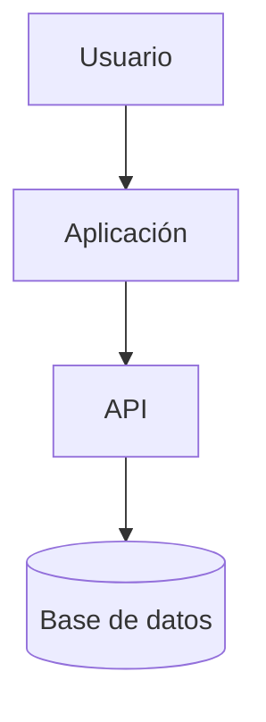

# Arquitectura técnica

## Diagrama general

## Componentes

| Componente | Responsabilidad | Tecnología |
|---|---|---|
| Frontend | UI | Pendiente |
| Backend | API y negocio | Pendiente |
| DB | Persistencia | Pendiente |

## Patrones

- Separación de responsabilidades.
- Validación en frontera.
- Autorización centralizada.
- Logs estructurados.
- Configuración por entorno.

## Decisiones relevantes

Ver `docs/adr/`.
