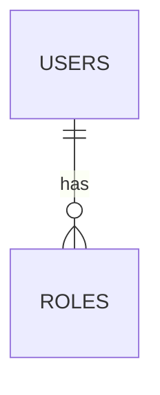

# Modelo de datos

## Entidades principales

| Entidad | Descripción |
|---|---|
| Pendiente | Pendiente |

## Convenciones

- Tablas en plural.
- Campos en `snake_case`.
- Llaves primarias explícitas.
- Migraciones versionadas.
- Datos sensibles clasificados.

## Diagrama ER

